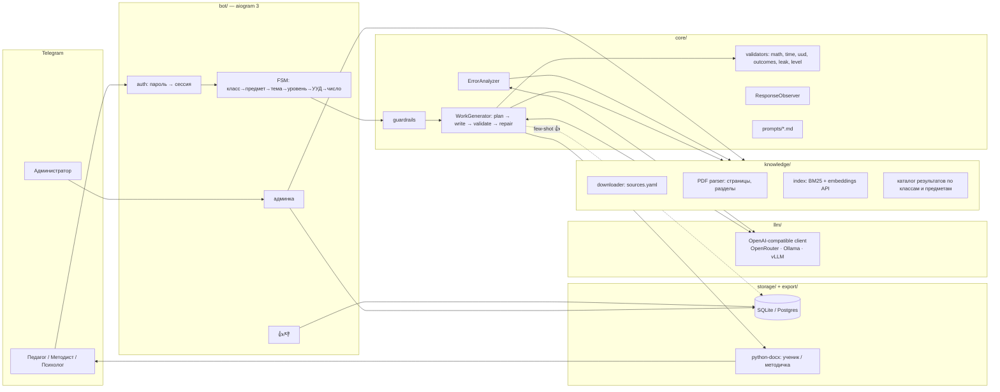

# Архитектура «Сократ» (SK01)

*Версия 1.0 · 25.09.2026*

## 1. Что строим

**Telegram-бот — помощник педагога, методиста и психолога.** Два основных сценария, по значимости равные:

1. **Конструктор диагностической работы.** Педагог выбирает класс (1–11), предмет, вводит тему, уровень (лёгкий / базовый / сложный / все три), фокус УУД и число заданий. Бот выдаёт **два Word-файла**:
   - `Задания_….docx` — лист ученика: задания + рефлексия, **без ответов**;
   - `Методичка_….docx` — для учителя: ответы и решения, карта планируемых результатов со ссылками на ФГОС/ФРП (источник, раздел, страница), наблюдаемые признаки УУД, типичные ошибки, приёмы, комментарий по проведению, план времени, ограничения.
2. **Анализ типичных ошибок.** Педагог словами описывает ошибку, которую делают дети (без имён). Агент:
   - раскладывает её по слоям: операциональный сбой / концептуальное заблуждение / регулятивный или коммуникативный дефицит;
   - связывает с УУД и предлагает 2–3 приёма коррекции из библиотеки;
   - даёт мини-задание для проверки гипотезы.

**Дополнительно:**
- разбор **обезличенного** ответа на задание (тесты кейса T06/T07);
- кнопки 👍/👎 под заданиями — хранятся и используются как few-shot примеры, то есть калибровка под школу;
- админ-панель: педагоги и пароли, обновление нормативной базы, загрузка материалов школы, расходы на LLM.

**Не делаем:** сканы и фото тетрадей, хранение любых данных детей, выставление отметок, диагнозы, визуальную подачу (отложена).

## 2. Принципы (обязательны для всех модулей)

| # | Принцип | Как обеспечивается |
|---|---|---|
| P1 | **LLM пишет — код проверяет.** Арифметика, время, ID результатов, страницы, цитаты, отсутствие ответов у ученика проверяются кодом | `core/validators/*`, цикл починки |
| P2 | **Никаких выдуманных норм.** Ссылаться можно только на результаты из локального каталога; цитата должна находиться на указанной странице PDF | `KnowledgeBase.get_outcome` + `get_page_text`, валидатор ссылок |
| P3 | **УУД — только при наличии наблюдаемого основания** (триггер в формулировке) | `UUDIndicator.trigger`, валидатор |
| P4 | **Без персональных данных детей.** Педагог хранится как ник + роль + хэш пароля; Telegram ID не храним | `contracts/users.py`, фильтр ПДн во вводе |
| P5 | **Ученик видит только `student_view(work)`** | `contracts/views.py`, тест T02 |
| P6 | **Честные границы.** Выбранные результаты ≠ весь ФГОС; внутренние коды ≠ номера пунктов; время расчётное; уровни ≠ способности ребёнка | `DiagnosticWork.limitations`, guardrails |
| P7 | **Провайдер LLM меняется через `.env`**: OpenRouter ↔ локальная модель | `llm/` на OpenAI SDK с `base_url` |
| P8 | **Модули общаются только через контракт** (`socrat.contracts`) | Протоколы + фейки |

## 3. Компоненты



### 3.1. Структура репозитория

```
AICaseSber/
├─ ARCHITECTURE.md            архитектура и принципы
├─ README.md                  запуск, проверка, ограничения
├─ pyproject.toml, .env.example, Dockerfile, docker-compose.yml, .github/workflows/ci.yml
├─ src/socrat/
│  ├─ contracts/              контракт: модели данных и протоколы модулей
│  ├─ config.py               настройки из .env
│  ├─ testing/                фейки и сценарная LLM для тестов и демо-режима
│  ├─ llm/                    OpenAI-совместимый клиент
│  ├─ core/                   генерация, проверки кодом, ограничители, анализ ошибок, разбор ответов
│  ├─ prompts/                промпты (Jinja2)
│  ├─ knowledge/              нормативная база: реестр, загрузка, парсинг, каталог, поиск
│  ├─ bot/                    Telegram-бот (aiogram 3)
│  ├─ storage/                SQLite: педагоги, сессии, работы, отзывы, расходы
│  ├─ export/                 Word-документы
│  └─ app.py                  сборка сервисов (composition root)
├─ data/
│  ├─ reference/sk01/         данные кейса (read-only)
│  ├─ fixtures/               эталонные DiagnosticWork / ErrorAnalysisResult
│  ├─ techniques.json         библиотека из 15 методических приёмов
│  └─ knowledge/              catalog/ и pages/ (в репозитории); raw/ и index/ — локально
├─ scripts/                   прогон проверок кейса, генерация примеров, отчёт по базе
├─ tests/                     contract/, core/, case_sk01/ (12 проверок кейса), unit/<модуль>/
├─ examples/                  работа, сгенерированная реальной моделью
├─ reports/                   результаты проверок кейса и отчёт по нормативной базе
└─ docs/                      SUBMISSION.md, cost.md, decisions.md
```

## 4. Поток данных: генерация работы

1. **Бот** собирает `GenerationRequest`: grade, subject_id, topic, level, uud_focus, task_count.
2. `generator.check_request(req)` → `GuardrailResult`. Быстрая проверка, без тяжёлых вызовов LLM:
   - класс и предмет есть в базе;
   - тема в программе класса (`knowledge.check_topic`), иначе WARN + варианты тем;
   - расчёт времени: `core.specs.estimate_work_minutes` → WARN, если вне 15–20 минут, с вариантами числа заданий;
   - ФИО детей не вводятся — об этом просят подсказки бота (автопоиск имён убран 24.09: он принимал «Законы Ньютона» за фамилию ребёнка);
   - нет просьбы о «пункте N ФГОС», которого нет, или о «гарантии полного соответствия ФГОС» → честный ответ + доступные результаты (T05, T12);
   - бот показывает WARN с кнопками «Продолжить» / «Изменить»; при BLOCK генерация не запускается.
3. `generator.generate(req, progress)`:
   1. **Контекст.** `knowledge.get_outcomes(grade, subject, query=topic)` + `knowledge.search(topic, kinds=[CONTENT, SUBJECT_RESULT])` + до 3 заданий с 👍 из `feedback.top_examples`.
   2. **Чертёж работы строит код, а не LLM** (`core/specs.py: build_blueprint`): для каждого уровня — типы заданий (`TaskKind`), целевая группа УУД и фраза-триггер, которую нужно включить в формулировку. При `balanced` каждая группа УУД встречается хотя бы раз. Уровни различаются опорами и самостоятельностью (`LEVELS`), а не объёмом (T09). Это дешевле и предсказуемее, чем отдельный LLM-вызов «план».
   3. Время на каждое задание тоже считает код (`estimate_task_minutes`: тип × уровень + чтение условия по скорости чтения класса).
   4. **LLM-вызов «вариант»** по чертежу (один вызов на уровень, уровни — параллельно). Строгий JSON: `student_text`, `support`, `solution_steps` с `expression` и остальные поля `Task`.
   5. **Валидаторы (код):**
      - `math`: каждое `expression` вычисляется безопасно (AST или sympy) и совпадает с `result`; итог совпадает с `expected_answer`; числа в пределах программы класса;
      - `leak`: в `student_text` и `support` нет решения или ответа;
      - `uud`: у каждого индикатора есть триггер в формулировке, иначе индикатор снимается;
      - `outcomes`: ID есть в каталоге, страница совпадает; цитата найдена на странице → `verified=true`;
      - `timing`: `estimated_minutes` ставит код по типу задания, уровню и длине текста; сумма вместе с чтением и рефлексией лежит в 15–20 минутах;
      - `language`: согласование числительных (pymorphy3), запрет ярлыков способностей и оценочной лексики о личности.
   6. **Починка.** Ошибки валидаторов уходят в LLM-вызов «repair» точечно, не более `LLM_MAX_REPAIRS` раз. Если задание так и не прошло проверку, оно перегенерируется или исключается с предупреждением.
   7. Сборка `DiagnosticWork`: `coverage`, `limitations`, `sources`, `meta` (модель, токены, стоимость, версия промптов).
4. **Бот:**
   - сохраняет работу (`works.save`) и расход (`usage.add`);
   - `exporter.student_docx` / `teacher_docx` → два файла в чат;
   - сообщение-сводка: план времени, предупреждения, кнопки 👍/👎 по заданиям, «Перегенерировать задание N».

## 5. Поток данных: анализ типичной ошибки

1. **Бот** собирает `ErrorAnalysisRequest`: класс → предмет → тема → описание ошибки.
2. `analyzer.check(req)`:
   - имена детей не вводятся (просьба в подсказке бота); автозамены на «[ученик]» нет — решение 24.09;
   - нет просьбы поставить диагноз → иначе BLOCK с объяснением границ.
3. `analyzer.analyze(req)`:
   1. Контекст: результаты по теме из `knowledge`, библиотека `techniques.json`.
   2. Один LLM-вызов → `ErrorAnalysisResult`.
   3. **Код проверяет:**
      - `technique_id` есть в библиотеке;
      - `outcome_links` проверены так же, как в генерации;
      - нет запрещённой лексики (диагнозы, «ленивый», «неспособен»);
      - гипотезы сформулированы как гипотезы.
4. **Бот:** форматированное сообщение + опционально `.docx`.

## 6. Нормативная база (knowledge)

- **Источники:** `knowledge/sources.yaml`:
  - ФГОС НОО (286), ООО (287), СОО (413, актуальная редакция);
  - ФОП НОО / ООО / СОО;
  - ФРП по предметам с edsoo.ru;
  - материалы школы (`SCHOOL_MATERIAL`, **не нормативные**: только для контекста, на них нельзя ссылаться как на норму).
- **Хранилище:** `data/knowledge/`:
  - `raw/*.pdf` — не в git;
  - `pages/<source_id>.jsonl` — текст по страницам PDF (1-based), не в git;
  - `index/` — BM25 и эмбеддинги, не в git;
  - `catalog/*.json` — **коммитим**: каталог планируемых результатов по уровням, классам и предметам;
  - `manifest.json` — sha256, дата проверки.
- **Каталог результатов** — ключевой артефакт для P2:
  - предметные результаты «к концу обучения в N классе» из ФРП;
  - метапредметные (познавательные, регулятивные, коммуникативные) и личностные — с уровня образования.
  - У каждой записи есть ID, тип, класс, предмет, **дословный текст**, source_id, раздел и страница.
  - Для математики 3 класса в каталог обязательно входят P01…L01 из кейса.
- **Поиск:** BM25 всегда; эмбеддинги через OpenAI-совместимый `/embeddings`, если заданы `EMBEDDINGS_*`; слияние результатов через RRF.
- **Обновление:** команда админа «Обновить базу» → `knowledge.update()`, пересчёт хэшей и переиндексация только изменённых документов.

## 7. Бот и безопасность

- **Вход:**
  - `/start` → «Введите пароль». Сообщение с паролем бот **сразу удаляет**.
  - Совпадение с `ADMIN_PASSWORD` → роль admin. Иначе поиск по хэшам паролей педагогов (argon2).
  - Сессия хранится по `sha256(chat_id + секрет)` с TTL `SESSION_TTL_HOURS`. Telegram ID в открытом виде не хранится.
  - Не больше `LOGIN_MAX_ATTEMPTS` попыток за `LOGIN_LOCKOUT_MINUTES` на чат. `/logout` завершает сессию.
- **Админ:**
  - «Добавить педагога»: ник → роль → бот генерирует пароль и показывает **один раз**;
  - список педагогов, сброс пароля, отключение, смена роли;
  - база ФГОС: статус, обновление, загрузка материала школы;
  - расходы (`usage.summary`);
  - «Оплата» — заглушка на будущее.
- **Педагог:** «📝 Создать работу», «🔍 Анализ типичной ошибки», «🧪 Разобрать ответ (обезличенно)», «ℹ️ Границы и источники», «🚪 Выйти».
- **Долгие операции** выполняются в фоне с `asyncio.Semaphore(MAX_CONCURRENT_GENERATIONS)`; прогресс показывается редактированием одного сообщения; у одного пользователя одновременно идёт не больше одной генерации.

## 8. Промпты

Да, у LLM **свой набор системных промптов**. Они лежат в `src/socrat/prompts/*.md` (шаблоны Jinja2), версионируются, и версия пишется в `DiagnosticWork.meta.prompt_version`.

| Файл | Назначение |
|---|---|
| `system_methodologist.md` | Роль и жёсткие правила (P2, P3, P6), язык по возрасту, каталог результатов и приёмов |
| `write_variant.md` | Один вариант работы по чертежу: задания, решения, УУД с цитатами, строгий JSON |
| `repair.md` | Точечная починка по ошибкам проверок кода |
| `error_analysis.md` | Анализ типичной ошибки |

## 9. Технологии

| Слой | Выбор |
|---|---|
| Язык | Python 3.12 (совместимо с 3.11) |
| Бот | aiogram 3, long polling (публичный URL не нужен) |
| LLM | `openai` SDK + `base_url` (OpenRouter / Ollama / vLLM), tenacity |
| Модели данных | Pydantic v2, pydantic-settings |
| БД | SQLAlchemy 2 async + aiosqlite (продакшн: PostgreSQL + asyncpg) |
| Пароли | argon2-cffi |
| PDF | PyMuPDF |
| Поиск | rank-bm25 + numpy (косинус по эмбеддингам из API) |
| Word | python-docx |
| Язык / математика | pymorphy3, sympy / AST-вычислитель |
| Тесты | pytest, pytest-asyncio; `@pytest.mark.llm` — вызовы реальной LLM |
| Запуск | Docker Compose (`bot` + том `data/`); опционально сервис `ollama` |

## 10. Разработка

- Работа идёт в ветках, изменения попадают в `main` через pull request. Условие слияния — зелёный CI (ruff + pytest).
- Коммиты в стиле Conventional Commits: `feat(core): …`, `fix(bot): …`, `docs: …`, `test(case): …`.
- Изменения контракта (`src/socrat/contracts/`) — отдельным PR с меткой `contract`.
- Секреты не коммитятся, `.env` хранится только локально.

## 11. Соответствие кейсу SK01 (12 проверок)

| Тест | Где обеспечивается |
|---|---|
| T01 — три версии × 4 задания + рефлексия, 15–20 мин | `LevelChoice.ALL`, `core.specs.estimate_work_minutes`, `TimePlan` |
| T02 — ответы верны, в ученической версии их нет | валидатор `math`, `student_view` |
| T03 — карта: цель, УУД, личностная направленность, источник, раздел, страница | `Task.outcome_links`, `uud_indicators`, `personal_orientation` |
| T04 — смена подачи сохраняет цель | `Task.modes` (отложено; тест помечен `xfail`, с объяснением) |
| T05 — неизвестный нормативный пункт | guardrail `UNKNOWN_NORM_REFERENCE` |
| T06 — число без объяснения | `ResponseObserver.observe` |
| T07 — «было трудно» | `observe_reflection` |
| T08 — 8 минут | guardrail `TIME_OUT_OF_RANGE` |
| T09 — сложная версия отличается не только объёмом | `LEVELS` в `core.specs` + проверка `check_levels` |
| T10 — неизвестный предмет или класс | guardrails `SUBJECT_UNKNOWN` / `GRADE_OUT_OF_RANGE` |
| T11 — изменение чисел → пересчёт | `regenerate_task` + валидатор `math` |
| T12 — «гарантируй весь ФГОС» | guardrail `FULL_FGOS_GUARANTEE` |
